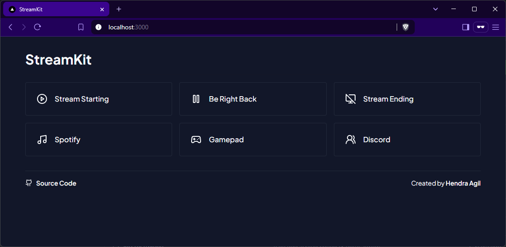

# Streamkit



## Installation

```bash
# Clone the repository
git clone git@github.com:hendraaagil/streamkit.git

# Install dependencies
cd streamkit
pnpm install
```

## Usage

1. Start the development server:

   ```bash
   pnpm dev
   ```

2. Open your browser and navigate to `http://localhost:3000`
